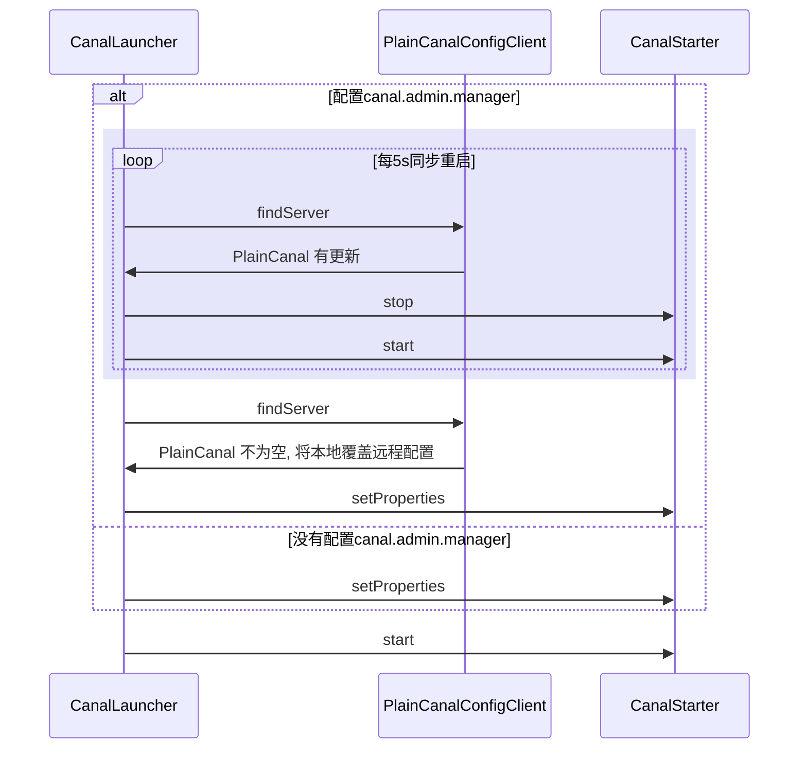
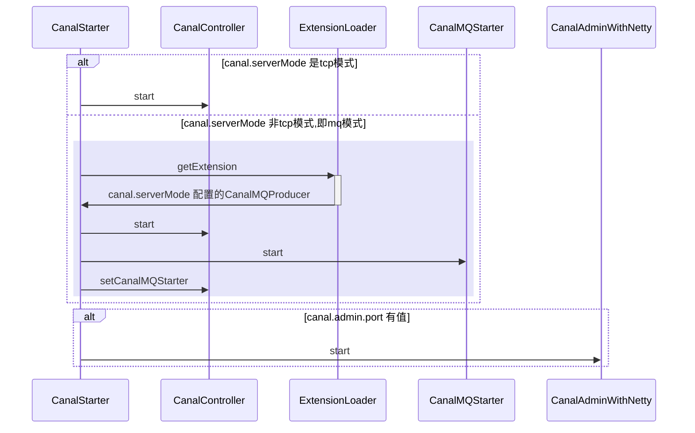
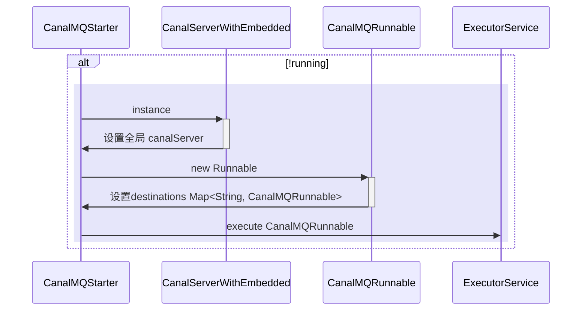
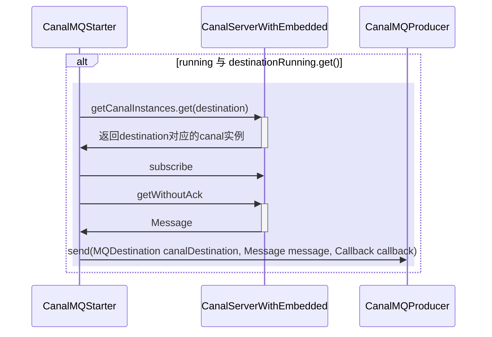
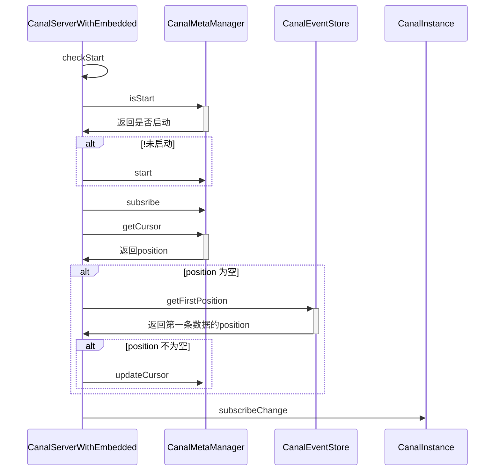

[toc]


* [ ] admin
* [ ] client
* [ ] client-adapter
* [ ] common
* [x] connector
* [ ] dbsync
* [x] deployer
* [ ] docker
* [ ] example
* [ ] filter
* [ ] images
* [ ] instance
* [ ] meta
* [ ] parse
* [ ] prometheus
* [ ] protocol
* [x] server
* [ ] sink
* [ ] store

## deployer

> 部署者

### CanalLauncher

* [x] 定时同步远程配置，有更新则重启应用
* [x] 使用CountDownLatch 挂起，应用down了再解除挂起



### CanalStarter

* [x] canalAdmin、controller、canalMQProducer、canalMQStarter

#### 启动流程图



## server

### CanalMQStarter



#### CanalMQRunable



##### CanalServerWithEmbedded

> subscribe




## connector

### CanalRocketMQProducer


## client-adapter

### 代码片段

> com.alibaba.otter.canal.client.adapter.support.Util#sqlRS(javax.sql.DataSource, java.lang.String, java.util.List<java.lang.Object>, java.util.function.Function<java.sql.ResultSet,java.lang.Object>)
>
> 匿名函数的运用

🌰

```java
public class Test {

    public static void main(String[] args) {
        System.out.println(func(rs -> rs.getA() + rs.getB()));
        System.out.println(func(rs -> rs.getA() * rs.getB()));
    }

    public static Object func(Function<Args, Object> func) {
        Args args = new Args();
        args.setA(1);
        args.setB(2);
        return func.apply(args);
    }

    static class Args {
        private int a;
        private int b;

        public int getA() {
            return a;
        }

        public void setA(int a) {
            this.a = a;
        }

        public int getB() {
            return b;
        }

        public void setB(int b) {
            this.b = b;
        }
    }
}
```

