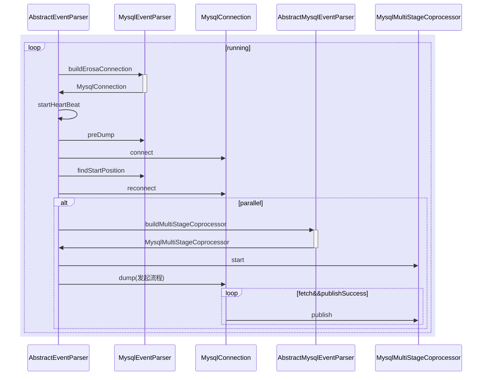
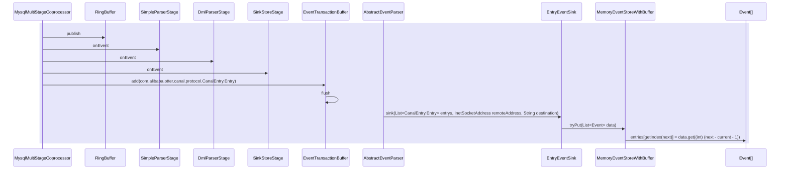

1. AbstractEventParser调用start，通过单线程中while方法开始任务
2. 通过MysqlConnection，dump下来 LogBuffer
3. 通过disruptor调度，SimpleParserStage 接收到MessageEvent（将其中的 LogBuffer，解析成LogEvent，并设置needDmlParse 参数）
4. 通过disruptor调度，needDmlParse 为true，则DmlParserStage接收MessageEvent（parse 其中的LogEvent变为 CanalEntry.Entry）
5. 通过disruptor调度，SinkStoreStage接收MessageEvent，使用EventTransactionBuffer 将 CanalEntry.Entry 传递
6. 通过EventTransactionBuffer中的全局回调函数TransactionFlushCallback，将List<CanalEntry.Entry> entrys传递到上一层级AbstractEventParser，
7. 通过AbstractEventParser中的全局CanalEventSink<List<CanalEntry.Entry>>，将List<CanalEntry.Entry> entrys传递到CanalEventSink中
8. 将List<CanalEntry.Entry> 转换成List<Event>后，通过CanalEventSink中的全局CanalEventStore<Event>中的tryPut传递
9. 通过CanalEventStore<Event>中的全局Event[] ，存储List<Event>。
10. CanalServerWithEmbedded 通过destination 获取获取全局的CanalInstanceWithSpring
11. 获取CanalInstanceWithSpring中的CanalEventStore<Event>（MemoryEventStoreWithBuffer），
12. 然后通过CanalEventStore<Event>中的tryGet获取到Events<Event>返回
13. 通过CanalRocketMQProducer，

### com.alibaba.otter.canal.parse.inbound.AbstractEventParser#start

### com.alibaba.otter.canal.store.memory.MemoryEventStoreWithBuffer#tryPut(java.util.List<com.alibaba.otter.canal.store.model.Event>)

